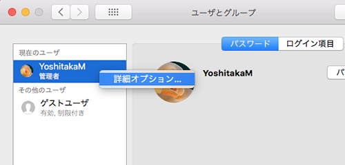
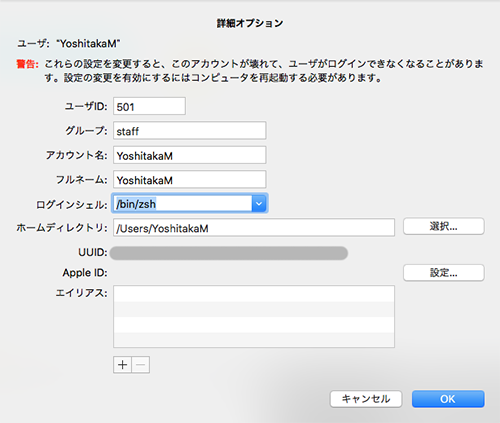

# zsh

## zshとは
**Z shell (zsh)** はUnixのコマンドシェルの1つです。zsh の名前は、当時プリンストン大学のティーチングアシスタントであったイェール大学教授 Zhong Shao のログイン名 "zsh" に由来して名付けられた……らしいです（Wikipedia）。

## zshの使い方
### macOSの場合
**[システム環境設定]** から **[ユーザーとグループ]** を選択して、左下の鍵マークをクリックしてパスワードを入力したあと、自身のユーザーアカウントの上で右クリックを押します。すると、詳細オプションというものが表示されますので、これを左クリックし、中の設定画面に移ります。

**詳細オプション** にはログインシェルという項目があるので、そこを `/bin/zsh` に変更してOKを押します。これで、ターミナルを起動したときのシェルがzshになります。

