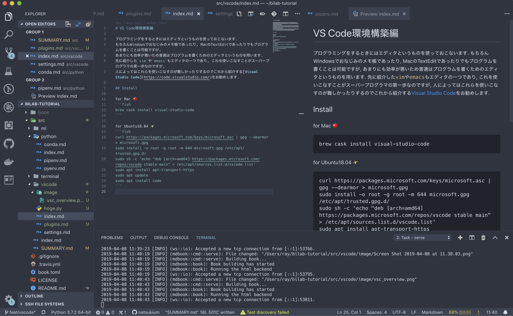

# VS Code環境構築編

プログラミングをするときにはエディタというものを使っておこないます.
もちろんWindowsでおなじみのメモ帳であったり, MacのTextEditであったりでもプログラムを書くことは可能ですが,
あまりにも効率が悪いため普通はプログラムを書くためのエディタというものを用います.
先に紹介した`vim`や`emacs`もエディタの一つであり, これを使いこなすことがスーパープログラマの第一歩なのですが,
人によってはこれらを使いこなすのが難しかったりするのでこれから紹介する[Visual Studio Code](https://code.visualstudio.com/)をお勧めします.



## Install

for Mac 🍎
```fish
brew cask install visual-studio-code
```

for Ubuntu18.04 🐧
```fish
curl https://packages.microsoft.com/keys/microsoft.asc | gpg --dearmor > microsoft.gpg
sudo install -o root -g root -m 644 microsoft.gpg /etc/apt/trusted.gpg.d/
sudo sh -c 'echo "deb [arch=amd64] https://packages.microsoft.com/repos/vscode stable main" > /etc/apt/sources.list.d/vscode.list'
sudo apt install apt-transport-https
sudo apt update
sudo apt install code
```
