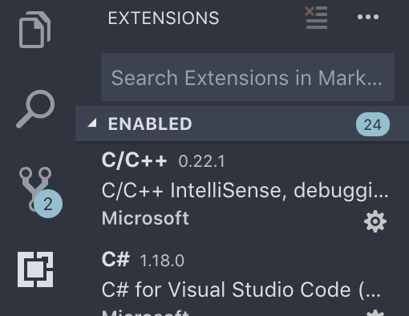

# plugins

VS CodeにはMS公式が配布するものからユーザーが個人で開発したものなど様々な拡張機能がありますが, デフォルトで多くの機能が付いているためあれもこれも入れないと使えないなんてことはありません.

そこでここではあると便利な必要最低限のもののみ紹介します.
もちろん他にも使い勝手の良いものはたくさん存在しているので慣れてきたら探してみてください.

## Install



VS Codeを開いたとき, 左側にアイコンが並んだバーが表示されると思います.
その中から上記画像の一番下の四角が組み合わさったものをクリックするとEXTENSIONSというタブが現れるのでそこから検索してInstallを実行しましょう.

## Recommend
### Python

Pyhonを書くことになったら必須レベルの拡張機能です.
次項で詳しく見ていきます.

Python以外の言語を書く場合, その言語の拡張機能を入れることによってVS CodeのIntelliSense(コード補完)やその他便利な機能が使えるようになるので, 目的にあったものを入れましょう.

### Material Icon Theme

ファイル名の前に表示されるアイコンが格好よくなります(主観).

### Nord

[Nord](https://www.nordtheme.com/)はVS Codeのカラーテーマの数ある一つで, とても格好よくなります(主観).
カラーテーマは自分好みのものを選べば良いと思いますが, VS Code以外の様々なアプリケーションに展開しているものを選ぶと統一感が出ておすすめです.

例として[solarized](https://ethanschoonover.com/solarized/)やmolokaiがあります.

### Bracket Pair Colorizer

プログラムを書く上で避けられない'()'を対応づけて色付けてくれるので少し見やすくなります.

デフォルトのカラーは少し品がないので, Nordのカラーに寄せておくと素敵です.
VS Codeの設定ファイルである, `settings.json`に記述しておきましょう.

```json
{
  "bracketPairColorizer.consecutivePairColors": [
    "()",
    "[]",
    "{}",
    ["#eceff4", "#d08770", "#b48ead"],
    "#bf616a"
  ]
}
```
