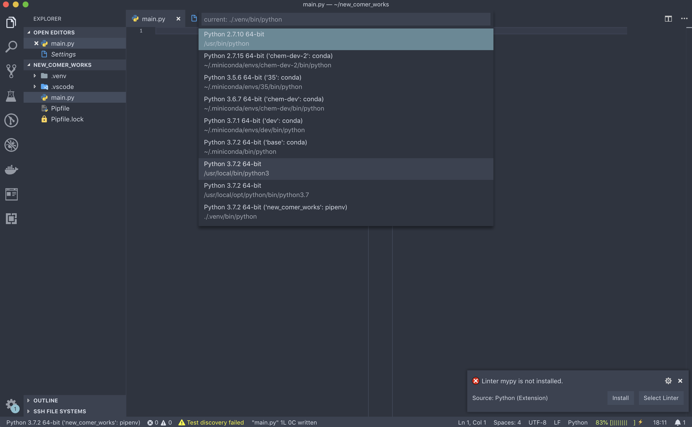
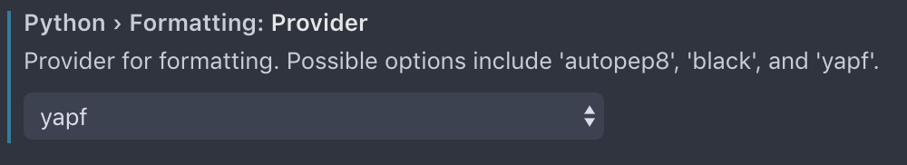
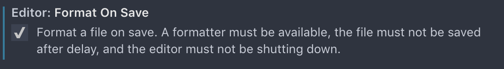

# Python

VS CodeでPythonを使いこなすTipsを紹介していきます.
この項では`pipenv`もしくは`conda`, およびVS CodeのPythonの拡張が入っていることを前提とするので,
まだ入れていない方は前に戻って入れてください.

## Start Project

ではまずプロジェクトのディレクトリを作成します.
pipenvの項と同じものを作成するので既に存在していれば作らなくて良いです.

```fish
mkdir new_comer_works; and cd new_comer_works
pipenv install numpy jupyter sklearn matplotlib
```

ターミナルからは`code`というコマンドでVS Codeを立ち上げることができます.
`code`のあとの`.`は現在のディレクトリを表すので覚えておくと良いでしょう.

```fish
code .
```

VS Codeを立ち上げたら適当なファイルを作成します. ここでは`main.py`としておきましょう.
Pythonのファイルを作成するとVS Codeの左下にPythonと書かれたフィールドができていると思うのでクリックしてみます.
すると使えるPython環境の一覧が出てくると思うので, 使いたいものを選んでください.
ここでは一番下の`pipenv`の環境を使います.



右下にいくつか警告が出るかもしれません. 今はテストのフレームワークは必要ないので無視して構いませんが,
Linterというものは有用なので有効化していきましょう.
ただし, ここではVS Code上ではインストールせずターミナルからインストールしていきます.


```fish
pipenv install --dev flake8 yapf
```

## Linter

Linterとは書いたコードがきちんと構文に従っているかチェックしてくれるもので, 見た目が統一されて綺麗になります.
他人の綺麗ではないコードを読むのは苦痛に耐えないので慣れておくようにしましょう.
しかし, 一つ一つの規則を覚えていくのは不毛なのでVS Codeにやってもらいましょう.

では左下の歯車アイコンからSettingsを開いてみましょう.
Search settingsから`Python`を検索し, 次の項目の設定をしておきましょう.




さらにファイルを保存したときにコードを整形しておくと便利なので`format on save`を検索しチェックを入れておくと良いでしょう.



## Jupyter

PythonにはJupyterという実行環境があって, データの可視化や1ステップごとにコードを実行することができます.
Jupyter Lab(Notebook) というWebベースの環境で実行するのが大半ですが, VS Code上でも実行することができます.
VS Codeで実行するメリットとしては
- IntelliSenseが使える
- デバッグが容易
- `.py`でも気軽に実行できる

などがあります.

### Usage

```python
#%%[markdown]
# # これはMarkdownのセル
# #%%でセルを生成,
# Shift + Enterで実行して次のセルに移動

#%%
lab = '┌(┌ ^o^ )┐'
lab + 'ﾗﾎﾞｫｴﾝｼﾞｮｲ'
```

### Try!

上記のコードが動くことを確認した後, 好きなグラフを出力してみましょう.
matplotlibの[ギャラリー](https://matplotlib.org/gallery/index.html)にたくさんサンプルがあるのでとりあえずコピペしてきてもいいと思います.
